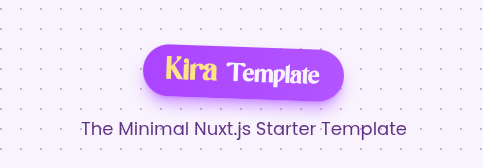

# Kira - The Minimal Nuxt.js Starter Template

A modern Nuxt.js starter template with TailwindCSS, DaisyUI integration, and TypeScript support.

## Features

- 🚀 [Nuxt.js](https://nuxt.com/) - The Vue.js Framework
- 💨 [DaisyUI](https://daisyui.com/) - Component Library for Tailwind CSS
- 🎨 [TailwindCSS](https://tailwindcss.com/) - Intuitive CSS Framework
- 🎨 Beautiful Kira Theme (designed with daisyUI)
- 🔤 Custom Font Configuration
  - Display: Lagistha
  - Sans/Body: Poppins
  - Mono: Roboto Mono
- 📝 TypeScript Support
- ⚡️ Powered by Bun for Fast Development
- 📦 [Pinia](https://pinia.vuejs.org/) - Intuitive State Management
- 🛠️ Utility Functions for Common Tasks


## Getting Started

### Prerequisites

- Node.js (v18 or higher recommended)
- [Bun](https://bun.sh/) (v1.0 or higher)

### Installation

1. Clone this template:
```bash
git clone https://github.com/michaelnji/kira.git my-project
```


2. Navigate to the project:
```bash
cd my-project
```

3. Install dependencies:
```bash
bun install
```

4. Start the development server:
```bash
bun dev
```

Visit `http://localhost:3000` to see your application.

## Project Structure

Key directories and files:
- `/assets`: Contains your source assets (CSS, icons, images)
- `/components`: Reusable Vue components
- `/layouts`: Page layout templates
- `/pages`: Application routes and views
- `/public`: Static files served at root path
- `/public/fonts`: Pre-bundled font families including:
  - Lagistha (Display font)
  - Poppins (Sans/Body font)
  - Roboto Mono (Monospace font)
- `/server`: Server-side code and API routes
- `/lib`: Utility functions and shared code
- `/types`: TypeScript type definitions
- Configuration files:
  - `app.config.ts`: Application-specific configuration
  - `nuxt.config.ts`: Nuxt.js configuration
  - `tsconfig.json`: TypeScript configuration
